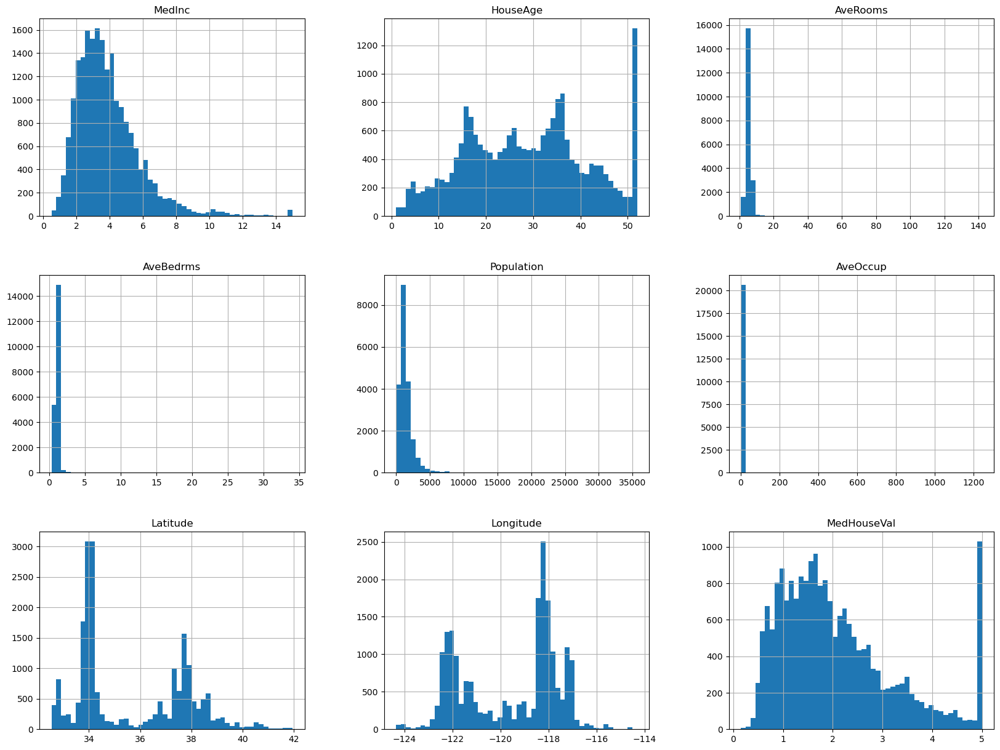
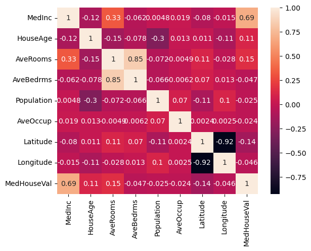
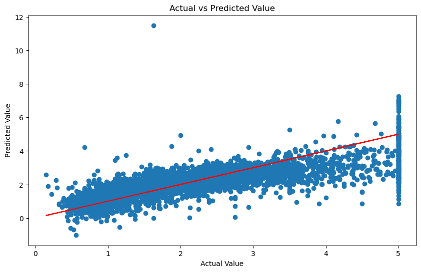

<h1>Predicting Home Prices with Linear Regression and Machine Learning</h1>

- [1. Introduction](#1)
- [2. Import Libraries](#2)
- [3. Load / Inspect the Data Set](#3)
- [4. Exploratory Data Analysis](#4)
- [5. Data Preprocessing](#5)
- [6. Splitting the Dataset](#6)
- [7. Model Building](#7)
- [8. Model Evaluation](#8)
- [9. Visualize the Results](#9)
- [10. Conclusion](#10)

<a id='1'></a>
## 1. Introduction
Our goal for this project is to investigate the the correlation between Home Prices and data points associated with them. We will be creating a Linear Regression model that will will be trained on The California Housing Data Set. This a very common dataset for this use case. Here is a itemized list of our goals:

- Clean and Prepare the Data to be used within our model.
- Create a Linear Regression Model and train it on our data.
- Inspect and Optimize our results using visual tools.
- Formulate our prediciton based on the models results

This notebook will be a mixture of text cells such as this one, and code cells that will contain code. Please follow along by running each code cell as we progress through the notebook. With all of that said, lets begin!


<a id='2'></a>
## 2. Import Libraries

To start, we need to import our librarys that we will be utiliizing fot this notebook.
<br></br>
- `import numpy as np` Numpy gives us access to arrays, matrices, and complex mathmatical equations.
<br></br>
- `import pandas as pd` Pandas gives us access to pandas dataframes. This will help us manipulate and analyze the data.
<br></br>
- `import matplotlib.pyplot as plt` matplotlib is an extremely popular tool to create charts and graphs with data. This will help us visualize the results.
<br></br>
- `import seaborn as sns` seaborn builds on top of matplotlib, and will allow us to make more attaractive and complex graphs. 
<br></br>
- `from sklearn import datasets` This is the method that we are using to import the California Housing Data. You could do this manually, but `datasets` is a easy way to access popular datasets.
<br></br>
- `from sklearn.datasets import fetch_california_housing` This is going to be the actual import of that Data Set. 
<br></br>
- `from sklearn import metrics` This will be used to check the effeciency of our model, and create a score system that will help us gauge the accuracy as refine the model.
<br></br>
- `from sklearn.model_selection import train_test_split` This is the metthod we will use to split our data into a train and test set. 80% of the data will be used for training the Linear Regression Model, and 20% will be used for testing its effeciency.
<br></br>
- `from sklearn.linear_model import LinearRegression` This is the actual linear regression model we will be using for this project. the `sklearn` library provides models that we can plug in and use to our project, without making one from scratch. We will still need to plug in our pieces to the model.
<br></br>
- `from sklearn.preprocessing import StandardScaler` This will be used to scale our data to a range of -1 to 1. This is important when working with machine learning models, because it assist the model in detecting correlation more effectively.

Lets import all of the above librarys into our project now.


```python
import numpy as np
import pandas as pd
import matplotlib.pyplot as plt
import seaborn as sns
from sklearn import datasets
from sklearn.datasets import fetch_california_housing
from sklearn import metrics
from sklearn.model_selection import train_test_split
from sklearn.linear_model import LinearRegression
from sklearn.preprocessing import StandardScaler
```

<a id='3'></a>
## 3. Load / Inspect the Dataset 
Our goal here is to load the data into our file so that we can start inspecting it. Assuming we have no experience with this datset before, lets load it into our notebook and start trying to understand it.
<br></br>
We can start by importing the California Housing Data using `datasets`.


```python
california = fetch_california_housing()
print(dir(california))
```

    ['DESCR', 'data', 'feature_names', 'frame', 'target', 'target_names']


First thing to do when importing a dataset like this is to use the `dir()` method to see what objects we have within the file.
    -`DESCR` gives us a Description of the data set. This is useful for understanding what this DataSet actually is, and how it was built.
    -`data` is the actual data that we will be analyzing.
    -`feature_names` is the list of data points that we will be using to train our model.
    -`target` this is the data point that we aim to predict.
    -`target_names` this is the the name of the target object.


```python
print("----------Description----------")
print(california.DESCR)
print("----------Feature Names----------")
print(california.feature_names)
print("----------Target Names----------")
print(california.target_names)
print("----------Target----------")
print(california.target)
print("----------Data----------")
print(california.data)
```

    ----------Description----------
    .. _california_housing_dataset:
    
    California Housing dataset
    --------------------------
    
    **Data Set Characteristics:**
    
        :Number of Instances: 20640
    
        :Number of Attributes: 8 numeric, predictive attributes and the target
    
        :Attribute Information:
            - MedInc        median income in block group
            - HouseAge      median house age in block group
            - AveRooms      average number of rooms per household
            - AveBedrms     average number of bedrooms per household
            - Population    block group population
            - AveOccup      average number of household members
            - Latitude      block group latitude
            - Longitude     block group longitude
    
        :Missing Attribute Values: None
    
    This dataset was obtained from the StatLib repository.
    https://www.dcc.fc.up.pt/~ltorgo/Regression/cal_housing.html
    
    The target variable is the median house value for California districts,
    expressed in hundreds of thousands of dollars ($100,000).
    
    This dataset was derived from the 1990 U.S. census, using one row per census
    block group. A block group is the smallest geographical unit for which the U.S.
    Census Bureau publishes sample data (a block group typically has a population
    of 600 to 3,000 people).
    
    An household is a group of people residing within a home. Since the average
    number of rooms and bedrooms in this dataset are provided per household, these
    columns may take surpinsingly large values for block groups with few households
    and many empty houses, such as vacation resorts.
    
    It can be downloaded/loaded using the
    :func:`sklearn.datasets.fetch_california_housing` function.
    
    .. topic:: References
    
        - Pace, R. Kelley and Ronald Barry, Sparse Spatial Autoregressions,
          Statistics and Probability Letters, 33 (1997) 291-297
    
    ----------Feature Names----------
    ['MedInc', 'HouseAge', 'AveRooms', 'AveBedrms', 'Population', 'AveOccup', 'Latitude', 'Longitude']
    ----------Target Names----------
    ['MedHouseVal']
    ----------Target----------
    [4.526 3.585 3.521 ... 0.923 0.847 0.894]
    ----------Data----------
    [[   8.3252       41.            6.98412698 ...    2.55555556
        37.88       -122.23      ]
     [   8.3014       21.            6.23813708 ...    2.10984183
        37.86       -122.22      ]
     [   7.2574       52.            8.28813559 ...    2.80225989
        37.85       -122.24      ]
     ...
     [   1.7          17.            5.20554273 ...    2.3256351
        39.43       -121.22      ]
     [   1.8672       18.            5.32951289 ...    2.12320917
        39.43       -121.32      ]
     [   2.3886       16.            5.25471698 ...    2.61698113
        39.37       -121.24      ]]


Above is a example of how we can print all of our information about the dataset to screen, and begin to understand what this Data is.  
- The Data is derived from the 1990 US Census. 
- Each row in the data is a block group of houses containing 600 - 3000 people. 
- Each block has 8 total features.
<br></br>
    - `MedInc`        median income in block group (Unit: 10,000 USD)
        <br></br>
    - `HouseAge`      median house age in block group
    <br></br>
    - `AveRooms`      average number of rooms per household
    <br></br>
    - `AveBedrms`     average number of bedrooms per household
    <br></br>
    - `Population`    block group population
    <br></br>
    - `AveOccup`      average number of household members
    <br></br>
    - `Latitude`      block group latitude
    <br></br>
    - `Longitude`     block group longitude
    <br></br>
- Each block has 1 Target
<br></br>
    - `MedHouseVal`   block group median house value (Unit: 100,000 USD
<br></br>

Now that we have an idea of what we are working with, lets import or data into a DataFrame to make it easier to manipulate, and visualize. 
    We will create a `df` variable to store our new `DataFrame` object, and assign the `feature_names` list as the columns. Then we add the `target` data to the dataframe and assign the same name as listed before, `MedHouseVal`


```python
df = pd.DataFrame(california.data,columns=california.feature_names)
df['MedHouseVal'] = california.target
```

<a id='4'></a>
## 4. Exploratory Data Analysis (EDA)
Our goal at ths point is to better understand that data and visualize it. We are looking for key points that stick out within our data that show correlation to our target value, the home price. Any correlation within the features will help us better predict the target value later on.
<br></br>
Lets start by inspecting our new DataFrame to make sure it is set up properly by typing the name of our object. In this case, `df` (shorthand for "Data Frame"


```python
df
```


<div>
<style scoped>
    .dataframe tbody tr th:only-of-type {
        vertical-align: middle;
    }

    .dataframe tbody tr th {
        vertical-align: top;
    }

    .dataframe thead th {
        text-align: right;
    }
</style>
<table border="1" class="dataframe">
  <thead>
    <tr style="text-align: right;">
      <th></th>
      <th>MedInc</th>
      <th>HouseAge</th>
      <th>AveRooms</th>
      <th>AveBedrms</th>
      <th>Population</th>
      <th>AveOccup</th>
      <th>Latitude</th>
      <th>Longitude</th>
      <th>MedHouseVal</th>
    </tr>
  </thead>
  <tbody>
    <tr>
      <th>0</th>
      <td>8.3252</td>
      <td>41.0</td>
      <td>6.984127</td>
      <td>1.023810</td>
      <td>322.0</td>
      <td>2.555556</td>
      <td>37.88</td>
      <td>-122.23</td>
      <td>4.526</td>
    </tr>
    <tr>
      <th>1</th>
      <td>8.3014</td>
      <td>21.0</td>
      <td>6.238137</td>
      <td>0.971880</td>
      <td>2401.0</td>
      <td>2.109842</td>
      <td>37.86</td>
      <td>-122.22</td>
      <td>3.585</td>
    </tr>
    <tr>
      <th>2</th>
      <td>7.2574</td>
      <td>52.0</td>
      <td>8.288136</td>
      <td>1.073446</td>
      <td>496.0</td>
      <td>2.802260</td>
      <td>37.85</td>
      <td>-122.24</td>
      <td>3.521</td>
    </tr>
    <tr>
      <th>3</th>
      <td>5.6431</td>
      <td>52.0</td>
      <td>5.817352</td>
      <td>1.073059</td>
      <td>558.0</td>
      <td>2.547945</td>
      <td>37.85</td>
      <td>-122.25</td>
      <td>3.413</td>
    </tr>
    <tr>
      <th>4</th>
      <td>3.8462</td>
      <td>52.0</td>
      <td>6.281853</td>
      <td>1.081081</td>
      <td>565.0</td>
      <td>2.181467</td>
      <td>37.85</td>
      <td>-122.25</td>
      <td>3.422</td>
    </tr>
    <tr>
      <th>...</th>
      <td>...</td>
      <td>...</td>
      <td>...</td>
      <td>...</td>
      <td>...</td>
      <td>...</td>
      <td>...</td>
      <td>...</td>
      <td>...</td>
    </tr>
    <tr>
      <th>20635</th>
      <td>1.5603</td>
      <td>25.0</td>
      <td>5.045455</td>
      <td>1.133333</td>
      <td>845.0</td>
      <td>2.560606</td>
      <td>39.48</td>
      <td>-121.09</td>
      <td>0.781</td>
    </tr>
    <tr>
      <th>20636</th>
      <td>2.5568</td>
      <td>18.0</td>
      <td>6.114035</td>
      <td>1.315789</td>
      <td>356.0</td>
      <td>3.122807</td>
      <td>39.49</td>
      <td>-121.21</td>
      <td>0.771</td>
    </tr>
    <tr>
      <th>20637</th>
      <td>1.7000</td>
      <td>17.0</td>
      <td>5.205543</td>
      <td>1.120092</td>
      <td>1007.0</td>
      <td>2.325635</td>
      <td>39.43</td>
      <td>-121.22</td>
      <td>0.923</td>
    </tr>
    <tr>
      <th>20638</th>
      <td>1.8672</td>
      <td>18.0</td>
      <td>5.329513</td>
      <td>1.171920</td>
      <td>741.0</td>
      <td>2.123209</td>
      <td>39.43</td>
      <td>-121.32</td>
      <td>0.847</td>
    </tr>
    <tr>
      <th>20639</th>
      <td>2.3886</td>
      <td>16.0</td>
      <td>5.254717</td>
      <td>1.162264</td>
      <td>1387.0</td>
      <td>2.616981</td>
      <td>39.37</td>
      <td>-121.24</td>
      <td>0.894</td>
    </tr>
  </tbody>
</table>
<p>20640 rows × 9 columns</p>
</div>


With our data converted to a DataFrame, its much easier to visualize the data. Before we start creating a model for this data, lets create some visualizations using the packages that we imported earlier. We can start by taking a staticstical overview of the Dataset using the `.describe()` method


```python
df.describe()
```


<div>
<style scoped>
    .dataframe tbody tr th:only-of-type {
        vertical-align: middle;
    }

    .dataframe tbody tr th {
        vertical-align: top;
    }

    .dataframe thead th {
        text-align: right;
    }
</style>
<table border="1" class="dataframe">
  <thead>
    <tr style="text-align: right;">
      <th></th>
      <th>MedInc</th>
      <th>HouseAge</th>
      <th>AveRooms</th>
      <th>AveBedrms</th>
      <th>Population</th>
      <th>AveOccup</th>
      <th>Latitude</th>
      <th>Longitude</th>
      <th>MedHouseVal</th>
    </tr>
  </thead>
  <tbody>
    <tr>
      <th>count</th>
      <td>20640.000000</td>
      <td>20640.000000</td>
      <td>20640.000000</td>
      <td>20640.000000</td>
      <td>20640.000000</td>
      <td>20640.000000</td>
      <td>20640.000000</td>
      <td>20640.000000</td>
      <td>20640.000000</td>
    </tr>
    <tr>
      <th>mean</th>
      <td>3.870671</td>
      <td>28.639486</td>
      <td>5.429000</td>
      <td>1.096675</td>
      <td>1425.476744</td>
      <td>3.070655</td>
      <td>35.631861</td>
      <td>-119.569704</td>
      <td>2.068558</td>
    </tr>
    <tr>
      <th>std</th>
      <td>1.899822</td>
      <td>12.585558</td>
      <td>2.474173</td>
      <td>0.473911</td>
      <td>1132.462122</td>
      <td>10.386050</td>
      <td>2.135952</td>
      <td>2.003532</td>
      <td>1.153956</td>
    </tr>
    <tr>
      <th>min</th>
      <td>0.499900</td>
      <td>1.000000</td>
      <td>0.846154</td>
      <td>0.333333</td>
      <td>3.000000</td>
      <td>0.692308</td>
      <td>32.540000</td>
      <td>-124.350000</td>
      <td>0.149990</td>
    </tr>
    <tr>
      <th>25%</th>
      <td>2.563400</td>
      <td>18.000000</td>
      <td>4.440716</td>
      <td>1.006079</td>
      <td>787.000000</td>
      <td>2.429741</td>
      <td>33.930000</td>
      <td>-121.800000</td>
      <td>1.196000</td>
    </tr>
    <tr>
      <th>50%</th>
      <td>3.534800</td>
      <td>29.000000</td>
      <td>5.229129</td>
      <td>1.048780</td>
      <td>1166.000000</td>
      <td>2.818116</td>
      <td>34.260000</td>
      <td>-118.490000</td>
      <td>1.797000</td>
    </tr>
    <tr>
      <th>75%</th>
      <td>4.743250</td>
      <td>37.000000</td>
      <td>6.052381</td>
      <td>1.099526</td>
      <td>1725.000000</td>
      <td>3.282261</td>
      <td>37.710000</td>
      <td>-118.010000</td>
      <td>2.647250</td>
    </tr>
    <tr>
      <th>max</th>
      <td>15.000100</td>
      <td>52.000000</td>
      <td>141.909091</td>
      <td>34.066667</td>
      <td>35682.000000</td>
      <td>1243.333333</td>
      <td>41.950000</td>
      <td>-114.310000</td>
      <td>5.000010</td>
    </tr>
  </tbody>
</table>
</div>


This gived us the count, mean, standard deviation, minimum, 25th percentile, median (50th percentile), 75th percentile, and maximum of all of data points. You can see that `count` shows 20640 for all of the columns. This is good news because it shows that are table has no missing. We can adress this further in the next section, but for now that means we can move forward wiout needing to adjust any values.
<br></br>
Lets create a some histograms of our data using `plt` that we imported earlier.


```python
df.hist(bins=50,figsize=(20,15))
plt.show()
```


    

    


One thing that sticks out to me right way, is the lack of proportion between median income and Median House Value. It is worth noting that the dataset has a upper limit on income set at 15, or 150,000. However, if this was an issue within the data, I believe that we would see a higher concentration of incomes at this number. Lets create some more charts to see if we can get a better understanding of whats happening. We will start with a Correlation Matrix, and a heat map to find a correlation between features and the target. We can use our import seaborn to create the heatmap.


```python
correlation_matrix = df.corr()
sns.heatmap(correlation_matrix, annot=True)
```


    <Axes: >


    

    


This heatmap shows a few correlations. Lets walk through the notable ones:
- High Correlation
    - Average Rooms to Average Bedrooms (0.85)
- Moderately High Correlation
    - Median Income to Median House Value (0.69)
- Low Correlation
    - Average Rooms to Median Income (0.33)
- Negative Low Correlation
    - Population to House Age
    
This gives us some insight into the correlations that will help us give weight to our features when training our model. We know that we have a moderate correlation between income and home value that will help us with our prediction. We also have a Low Correlation between between Average Rooms and Median Income that could be benefecial.
<br></br>
Lets move on to processing our data and beginning to prepair it for our model.

<a id='5'></a>
## 5. Data Preprocessing

Our goal currently is to Preprocess the data to prepare it for our models use. There are a couple things that we can do to prepare the data. 
    - Handle NaN values
    - Handle Missing Values
    - Standardizing / Normalizing the feature data to assist the modeling in finding correlations.
    
We dont have any NaN Values in our Table, but if we did, we could handle them by replacing them with the median value for that feature. For example, if we has a value missing in `HouseAge` we could replace it with the mean value which would be in this case, 28.64.
We can do that using the the `.fillna()` method.


```python
df.fillna(df.mean(),inplace=True)
```

Next, need to isolate our features list from our target in the table. The easist way to do this would be to group them together into a variable. After that, we need to scale our features to make them proportional for the model (-1 to 1). We can do that using the `StandardScaler` object from scikit.


```python
features = ['MedInc', 'HouseAge', 'AveRooms', 'AveBedrms', 'Population', 'AveOccup', 'Latitude', 'Longitude']
target = ['MedHouseVal']

scaler = StandardScaler()
df[features] = scaler.fit_transform(df[features])

```

It's also worth noting that while this dataset only includes numerical data, we would need to adjust the data into numerical values if they were categorical data. A simple example would be a column titled `IsForSale` that contained a True or False value depending on the if the home was for sale. You could handle this by using the `.get_dummies()` method that will convert these data points into numbers, letting them be interpretted by the model. This would also apply to something like `HouseColor` that could have the color of the home as the value. You would convert for example the value `"Red"` to 1, and `"Blue"` to 2, etc. A example of call of this would be:


```python
pd.drop_dummies(df,drop_first=True)
```

<a id='6'></a>
## 6. Splitting the Dataset
The final step before building our model is to split our data into two pieces. The reason we do this is so that the data that is used to train our model is not the same data used to test it. For example, if we trained our model on 100% of our data, the only data we would be able to provide it would be data that it was already trained on, giving the model the benefit of having already seen the data. In the same way that when studying fot a test, we commonly use questions from prior test. This gives us insight into what we should expect on the test, without seeing the actual questions/answers themselves. 
<br></br>
Another benefit to doing this, is that we have a metric to track the accuracy of our model. Once we are done training it, we have all of our test data to use as a scoring system for our models accuracy. This will give us oppritunity to see real time the effects from changes we make.
<br></br>
The ratio we will be using to splitting our data set is 80% training data, and 20% testing data. There is a simple way to split our data using the `train_test_split` method we imported earlier.
<br></br>
We need to do the following:
- Assign DataFrame (minus the target) to `X`
- Assign the target to `y`
- Split the data using `train_test_split`
- Assign the split data into train and test variables.
         


```python
X = df.drop('MedHouseVal',axis=1)
y = df['MedHouseVal']

X_train, X_test, y_train, y_test = train_test_split(X,y,test_size=0.2,random_state=42)
```

## 7. Model Building

Before we move forward, I think it would be benefecial to highlight what is happening behind the scenes of our Linear Regression Model. We have multiple features included in our prediction, but if we had only one, we would be using this very popular formula:
### Y = mx + b
##### Y = y point
##### X = x point
##### m = slope 
##### b = y-intercept 

An example of this would be a single feature that is believed to influence the price of the home such as the `MedInc` data from our table. You could illustrate this as:
### MedianHouseValue = m(Median Income) + b
##### Y = Target
##### X = Feature
##### m = Increase in home value per increase in income
##### b = Estimated home value when income reaches zero


Whenever we add more features we are changing the equation by adding more X sequenses.
### Y = 1mx1 + 2mx2 + 3mx3 + 4mx4.... + b      
##### Note: m & x variables are associated with each individual feaure. m#1 is multiplied by x#1

<br></br>
or in our case:
#### `MedHouseVal` = b +  (m`df[0]` * `MedInc`)+ (m`df[1]` * `HouseAge`) + (m`df[2]` * `AveRooms`) + (m`df[3]` * `AveBedRms`) + (m`df[4]`*`Population` ) + (m`df[5]` *  `AveOccup` ) + (m`df[6]` * `Lattitude` ) + `(df[7]` * `Longitude`)

`df[n]` representing the version of the slope needed for that section of the equation. `MedInc` is indexed at `df[0]`

The good news is that if this doesnt make sense to you, that is okay, because our `scikit-learn` model takes care of all of this and more for us. We can now create the model using the following syntax.


```python
model = LinearRegression()
model.fit(X_train,y_train)
```


<style>#sk-container-id-3 {color: black;background-color: white;}#sk-container-id-3 pre{padding: 0;}#sk-container-id-3 div.sk-toggleable {background-color: white;}#sk-container-id-3 label.sk-toggleable__label {cursor: pointer;display: block;width: 100%;margin-bottom: 0;padding: 0.3em;box-sizing: border-box;text-align: center;}#sk-container-id-3 label.sk-toggleable__label-arrow:before {content: "▸";float: left;margin-right: 0.25em;color: #696969;}#sk-container-id-3 label.sk-toggleable__label-arrow:hover:before {color: black;}#sk-container-id-3 div.sk-estimator:hover label.sk-toggleable__label-arrow:before {color: black;}#sk-container-id-3 div.sk-toggleable__content {max-height: 0;max-width: 0;overflow: hidden;text-align: left;background-color: #f0f8ff;}#sk-container-id-3 div.sk-toggleable__content pre {margin: 0.2em;color: black;border-radius: 0.25em;background-color: #f0f8ff;}#sk-container-id-3 input.sk-toggleable__control:checked~div.sk-toggleable__content {max-height: 200px;max-width: 100%;overflow: auto;}#sk-container-id-3 input.sk-toggleable__control:checked~label.sk-toggleable__label-arrow:before {content: "▾";}#sk-container-id-3 div.sk-estimator input.sk-toggleable__control:checked~label.sk-toggleable__label {background-color: #d4ebff;}#sk-container-id-3 div.sk-label input.sk-toggleable__control:checked~label.sk-toggleable__label {background-color: #d4ebff;}#sk-container-id-3 input.sk-hidden--visually {border: 0;clip: rect(1px 1px 1px 1px);clip: rect(1px, 1px, 1px, 1px);height: 1px;margin: -1px;overflow: hidden;padding: 0;position: absolute;width: 1px;}#sk-container-id-3 div.sk-estimator {font-family: monospace;background-color: #f0f8ff;border: 1px dotted black;border-radius: 0.25em;box-sizing: border-box;margin-bottom: 0.5em;}#sk-container-id-3 div.sk-estimator:hover {background-color: #d4ebff;}#sk-container-id-3 div.sk-parallel-item::after {content: "";width: 100%;border-bottom: 1px solid gray;flex-grow: 1;}#sk-container-id-3 div.sk-label:hover label.sk-toggleable__label {background-color: #d4ebff;}#sk-container-id-3 div.sk-serial::before {content: "";position: absolute;border-left: 1px solid gray;box-sizing: border-box;top: 0;bottom: 0;left: 50%;z-index: 0;}#sk-container-id-3 div.sk-serial {display: flex;flex-direction: column;align-items: center;background-color: white;padding-right: 0.2em;padding-left: 0.2em;position: relative;}#sk-container-id-3 div.sk-item {position: relative;z-index: 1;}#sk-container-id-3 div.sk-parallel {display: flex;align-items: stretch;justify-content: center;background-color: white;position: relative;}#sk-container-id-3 div.sk-item::before, #sk-container-id-3 div.sk-parallel-item::before {content: "";position: absolute;border-left: 1px solid gray;box-sizing: border-box;top: 0;bottom: 0;left: 50%;z-index: -1;}#sk-container-id-3 div.sk-parallel-item {display: flex;flex-direction: column;z-index: 1;position: relative;background-color: white;}#sk-container-id-3 div.sk-parallel-item:first-child::after {align-self: flex-end;width: 50%;}#sk-container-id-3 div.sk-parallel-item:last-child::after {align-self: flex-start;width: 50%;}#sk-container-id-3 div.sk-parallel-item:only-child::after {width: 0;}#sk-container-id-3 div.sk-dashed-wrapped {border: 1px dashed gray;margin: 0 0.4em 0.5em 0.4em;box-sizing: border-box;padding-bottom: 0.4em;background-color: white;}#sk-container-id-3 div.sk-label label {font-family: monospace;font-weight: bold;display: inline-block;line-height: 1.2em;}#sk-container-id-3 div.sk-label-container {text-align: center;}#sk-container-id-3 div.sk-container {/* jupyter's `normalize.less` sets `[hidden] { display: none; }` but bootstrap.min.css set `[hidden] { display: none !important; }` so we also need the `!important` here to be able to override the default hidden behavior on the sphinx rendered scikit-learn.org. See: https://github.com/scikit-learn/scikit-learn/issues/21755 */display: inline-block !important;position: relative;}#sk-container-id-3 div.sk-text-repr-fallback {display: none;}</style><div id="sk-container-id-3" class="sk-top-container"><div class="sk-text-repr-fallback"><pre>LinearRegression()</pre><b>In a Jupyter environment, please rerun this cell to show the HTML representation or trust the notebook. <br />On GitHub, the HTML representation is unable to render, please try loading this page with nbviewer.org.</b></div><div class="sk-container" hidden><div class="sk-item"><div class="sk-estimator sk-toggleable"><input class="sk-toggleable__control sk-hidden--visually" id="sk-estimator-id-3" type="checkbox" checked><label for="sk-estimator-id-3" class="sk-toggleable__label sk-toggleable__label-arrow">LinearRegression</label><div class="sk-toggleable__content"><pre>LinearRegression()</pre></div></div></div></div></div>


<a id='8'></a>
## 8. Model Evaluation and Visualization

Now that our model is fitted with the correct data, its time to make the first prediction. We can get our predicted Y values from the model by running the predict method attached to the model, with the Feature data as the parameter. 


```python
y_pred = model.predict(X_test)
```

There a few common ways to gauge the accuracy of our model. With a regression model like we have here, there isnt as much of a clear cut accuracy scale. We can however use the `r2_score` function to tell how well our model interperetted the data. 

the r2 represents the proportion of the  variation in target that is predictable from the feature list (scale 0 - 1). The higher a r2 score, the more accurately that the feature list explains the variance in target. an r2 score of .8 represents that our feature list was able to explain 80% of our variance intarget data. a higher correlation of feature and target would increase this number, creating a more accurate model.However, this does not directly mean that our model would have a 80% accuracy. Lets check our r2 score now.


```python
r2 = r2_score(y_test, y_pred)
print(f"R-squared (R²): {r2}")

```

    R-squared (R²): 0.575787706032451


A R-Squared score of 0.57 means that only 57% of our variation in target data was able to explained with our feature list. This could mean that we are missing pivotal information to predict our home prices, or that we need to change the parameters of our model. We could be seeing data that isnt relevant isnt relevant to the price affecting the prediciton. Before we change our parameters, lets inspect a scatter plot of our points and see what it tells us about our accuracy.


```python
plt.figure(figsize=(10,6))
plt.scatter(y_test,y_pred)
plt.xlabel('Actual Value')
plt.ylabel('Predicted Value')
plt.title('Actual vs Predicted Value')

plt.plot(y_test,y_test,color="red")
plt.show
```


    <function matplotlib.pyplot.show(close=None, block=None)>


    

    


The red line on this graph represents a perfect score. a point located on x-axis of 2, and y-axis of 2 would mean that the home value was $200,000 and the model accurately predicted it. We can see that our model has some outliers that were very far off from the scale. This is visual evidence of our low r2-score. Lets improve our model and try again.

<a id='9'></a>
## 9. Optimization
In section 4, we preformed Exploratory Data Analysis of our DataSet. We descovered that we had a few correlations with our price that could possibly influence our target itself, but also features that influenced the target. We will preform two new models. 
- Median Income,Average Rooms,and House Age as features.

This is what most would call "pruning" our model of excess data that does not contribute to our target. Lets do that now.


```python
X = df[['MedInc','HouseAge','AveRooms']]
y = df['MedHouseVal']

X_train, X_test, y_train, y_test = train_test_split(X, y, test_size=0.2, random_state=42)
model = LinearRegression()
model.fit(X_train, y_train)
y_pred = model.predict(X_test)
r2 = metrics.r2_score(y_test, y_pred)

print('R-squared:', r2)

```

    R-squared: 0.49717158850807075


Our R-score is .497 for that model. Now lets try just Median Income.


```python
X = df[['MedInc']]
y = df['MedHouseVal']

X_train, X_test, y_train, y_test = train_test_split(X, y, test_size=0.2, random_state=42)
model = LinearRegression()
model.fit(X_train, y_train)
y_pred = model.predict(X_test)
r2 = metrics.r2_score(y_test, y_pred)

print('R-squared:', r2)
```

    R-squared: 0.45885918903846656


Our score has now dropped to .459 . This tells us that my hypothis was wrong. However, all hope is not lost. After testing different feature list, there is a way to improve the model, but ever so slightly.


```python
X = df[['MedInc','HouseAge','AveRooms','Latitude','Longitude']]
y = df['MedHouseVal']

X_train, X_test, y_train, y_test = train_test_split(X, y, test_size=0.2, random_state=42)
model = LinearRegression()
model.fit(X_train, y_train)
y_pred = model.predict(X_test)
r2 = metrics.r2_score(y_test, y_pred)

print('R-squared:', r2)
```

    R-squared: 0.5813744243302474


Using Median Income, House Age, Average Rooms, Lattitude, and Longitude we have improved our intial score from .5758 to .5813. This is not a drastic difference, but this tells me that we have closed to maxed out our ability to predict given the limitations of this model and the paramters that we have. Lets plot the model to see our final result. 


```python
plt.figure(figsize=(10,6))
plt.scatter(y_test,y_pred)
plt.xlabel('Actual Value')
plt.ylabel('Predicted Value')
plt.title('Actual vs Predicted Value')

plt.plot(y_test,y_test,color="red")
plt.show
```


    <function matplotlib.pyplot.show(close=None, block=None)>


    

    


As you can see, we were able to remove lots of our outliers. I consider this a succefful model given the limitations. There is a multitude of directions that can be taken to improve this prediction, but we will discuss them further in a seperate notebook.

<a id='10'></a>
## 10. Conclusion
Thank you for taking the time to read through this notebook and view my interpretation of this data set. In this section I want to cover a few things before I finish.

#### What does that data say about the Home Prices?
When we analyzed the data, we found a correlation between Income and Home value. We predicted that other aspects of the home would contribute to the price prediction as well, but we found that latitude, longittude, income, age of home, and average rooms played the largest role in creating the prediction. Its worth noting, that Income, House Age, Average Rooms,Lattitude,and Longitude were the the 5 largets contributers in prediction, due to acheiving a higher than original prediction with just the 5 (.5813). The correlation bewteen Location and home price was over looked in our heatmap illustration but showed to be influential in our final prediction.

#### What could we do to improve the model?
One key way this model could be expanded upon would be to utlize feature engineering and create new features based on the data we have. An exmaple of this would be creating a new column that included the standard deviation of the features. This is to create new ways for the model to access the same information, but in a more meaningful format.

Another way to improve the prediction would be to utilize a diffent model all together. A Linear Regression model is a very simple equation from the perspective of the larger pool of rescources. Something like a neural network could be used to create a tree of decesions that predict the price. This would be benefecial because their could be concepts within the data that are not recognized by the slope formula. An example of this would be paramters that show home values are always within a given range when the population is within a given range. This would further expand the models accuracy.


### Thank you for your time, and I hope that you enjoyed reading this as much as I did creating it.

### - Hunter Lanier


```python

```


```python

```
